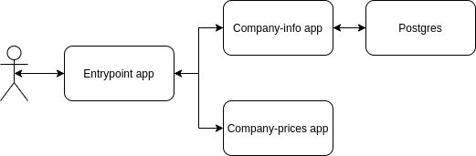

# Motivation

As usual, I wanted to try new technologies and have up-to-date code examples written by me that might help me during a job interview.

Most of my career I have worked with spark.
As new technologies I decided to try something from the standard backend stack - rest api and microservices.

## Tracing

The main aim.
Let's say we have a product based on microservices. Our customer can click on a button - the button will call microservice A that service in its turn will call microservices B and C, B can interact with a database, and so on.
If in the result our customer got an error or waited for too long - how can we find out where is the problem?

Of course, we can check logs but it will be painful:
- we need to check logs of different services
- we need to collect events from them into a single chain responsible for exactly our customer's request (if we work under load it can be almost impossible because of too many events)

Things like [Jaeger](https://www.jaegertracing.io/) can help us to simplify this process.

To interact with jaeger let's use [trace4cats](https://github.com/trace4cats/trace4cats).

## Swagger generation from code

The secondary aim.
To share api details with other teams we often use swagger. If we write both rest api and swagger ourselves it leads to problems:
- code duplication (api implementation and its description)
- a place for a mistake. You can change implementation and forget to change swagger or vice versa

Can we somehow improve it? [Tapir](https://github.com/softwaremill/tapir) says we can. Let's try


# Architecture

Let's build a simple application that will provide info about company shares.



As the final result we need to show to users something like -
```json
{
   "name": "Apple Inc.",
   "ticker": "AAPL",
   "prices": [
      148.99,
      148.56,
      146.8
   ]
}
```

## Entrypoint app

This application is the entry point for users. Its main responsibility is combining info from other services and handling possible failures.  

## Company-info app

It will provide common info about companies by interacting with Postgres. Two urls:

1. list of all available companies, GET /company -
```json
[
   {
      "name": "Apple Inc.",
      "ticker": "AAPL"
   },
   {
      "name": "Microsoft Corporation",
      "ticker": "MSFT"
   }
]
```
2. or the same info but for a particular share, GET /company/$ticker  -
```json
   {
      "name": "Apple Inc.",
      "ticker": "AAPL"
   }
```

## Company-prices app

Application responsible for prices for each share, GET /prices/$ticker -

```json
{
  "prices": [
    250.25,
    249.02,
    244.14
  ]
}
```

# Implementation details

For rest api (server and client) we can use http4s. For interacting with Postgres doobie.

Execution process could consist of:
- Entrypoint receives a request
- Entrypoint submits two requests (to Company-info and to Company-prices) in parallel
- Company-prices replies with prices
- Company-info gets common info from Postgres and replies
- Entrypoint combines two results into one json and replies to the caller

In an ideal world that would be enough but in the real world we can face different problems. For example:
- network issues. DB or a service can be unavailable or respond for too long
- any internal errors (e.g. integration with an unreliable third party service which we cannot make stable)

Let's add [reties](./entry-point/src/main/scala/com/itsukanov/entrypoint/Retries.scala) to solve it.
One main requests plus two retries - maximum of three attempts.

To simulate problems we can add [ProblemsSimulator](./base-app/src/main/scala/com/itsukanov/common/problems/ProblemsSimulator.scala).
As the default behaviour we will use [DefaultProblemsSimulator](./base-app/src/main/scala/com/itsukanov/common/problems/DefaultProblemsSimulator.scala) based on
```scala
new CombinedSimulator(
    Seq(
      (40, HappyPath),
      (30, new TimedOut(5.seconds)),
      (30, FailedWithError)
    )
  )
```
where numbers are probabilities (40% - success, 60% - failure).

# Results

## Tracing

## Swagger generation

# Want to try it locally?

If you want to try it locally you need:

1. installed docker, jre8+, and sbt

2. start applications via
```bash
sbt companyInfo/run
sbt companyPrices/run
sbt entryPoint/run
```

3. start jaeger (full details [here](https://www.jaegertracing.io/docs/1.22/getting-started/#all-in-one))
```bash
docker run -d --name jaeger \
  -p 6831:6831/udp \
  -p 16686:16686 \
  jaegertracing/all-in-one:1.22
```

4. open in a web browser [jager](http://localhost:16686/search) and [entry point swagger](http://localhost:8081/docs).
   Use default auth Bearer token="123"  

# Other notes

This project is a POC with a very limited number of aims described in the [motivation](#motivation).

It doesn't need long-term support. That's why:
- there are no tests and configuration via the standard typesafe config
- several todo's were not fixed
- two similar libraries in the classpath (`cats-retry` vs `org.http4s.client.middleware.Retry`)

Most probably there are some other non-optimal decisions that could be done better but again these non-optimal decisions
are outside the main project aims.
